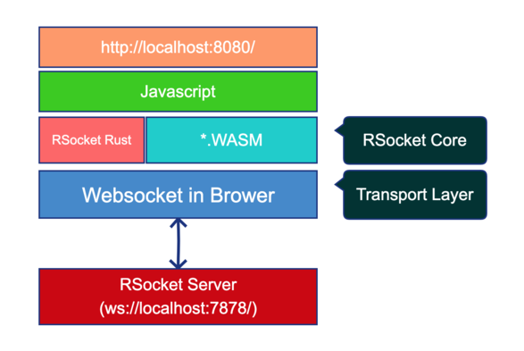

# rsocket-rust-wasm-example

An example which show how RSocket works in browser with Rust + Webassembly.



## Getting Start

### Requirements

- Rust 1.39+
- Node.js
- Start an websocket RSocket server

### Run

0. Clean: `rm -fr target && rm -f Cargo.lock`
1. Install `wasm-pack` tool: `cargo install wasm-pack`
2. Execute `wasm-pack build`
3. Execute `yarn` (or `npm install`)
4. Execute `yarn run serve` (or `npm run serve`)
5. Open [http://localhost:8080/](http://localhost:8080/) and you will see an alerting dialog with response message.

## FAQ

> How to start an websocket RSocket echo server?

You can use [rsocket-cli](https://github.com/rsocket/rsocket-cli) to start an echo server.

```shell
$ rsocket-cli -i 'Pong!' --server --debug ws://127.0.0.1:7878
```

Or you can write some code, here's a java example.

```java
package com.example.rsocket;

import io.rsocket.AbstractRSocket;
import io.rsocket.Payload;
import io.rsocket.RSocketFactory;
import io.rsocket.transport.netty.server.WebsocketServerTransport;
import io.rsocket.util.DefaultPayload;
import java.lang.invoke.MethodHandles;
import org.slf4j.Logger;
import org.slf4j.LoggerFactory;
import reactor.core.publisher.Mono;

public class Foboar {

  private static final Logger log = LoggerFactory.getLogger(MethodHandles.lookup().lookupClass());

  public static void main(String[] args) {
    RSocketFactory.receive()
        .acceptor(
            (setup, sendingSocket) ->
                Mono.just(
                    new AbstractRSocket() {
                      @Override
                      public Mono<Payload> requestResponse(Payload payload) {
                        log.info("receive: {}", payload.getDataUtf8());
                        return Mono.just(DefaultPayload.create("Pong!"));
                      }
                    }))
        .transport(WebsocketServerTransport.create(7878))
        .start()
        .block()
        .onClose()
        .block();
  }
}

```
